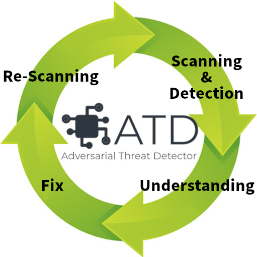
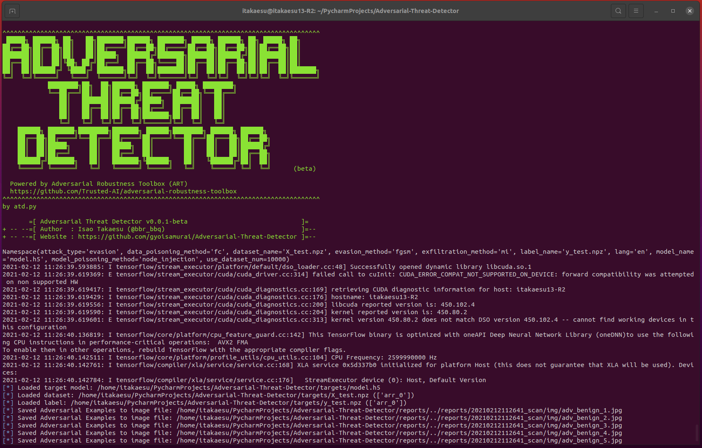
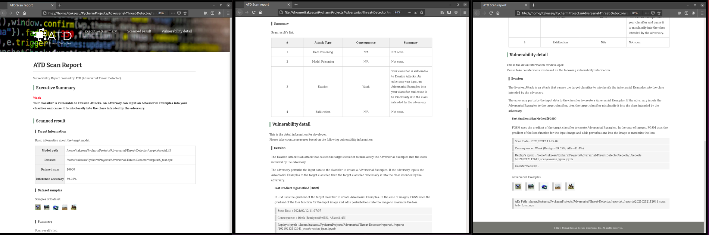
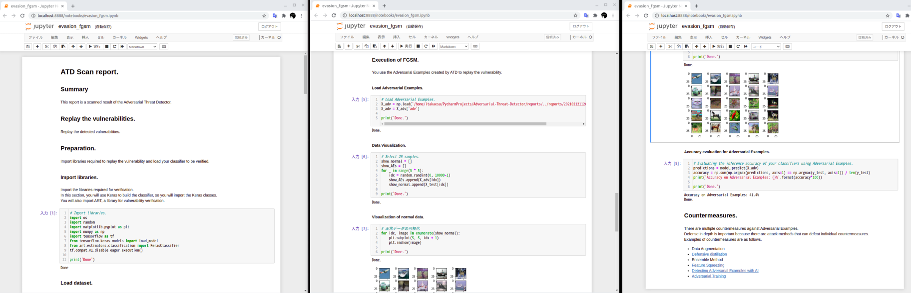

# Adversarial-Threat-Detector
[Japanese page](./README_ja.md)  

In recent years, deep learning technology has been developing, and various systems using deep learning are spreading in our society, such as face recognition, security cameras (anomaly detection), and ADAS (Advanced Driver-Assistance Systems).  

On the other hand, there are many attacks that exploit vulnerabilities in deep learning algorithms. For example, the Evasion Attacks are an attack that causes the target classifier to misclassify the Adversarial Examples into the class intended by the adversary. the Exfiltration Attacks are an attack that steals the parameters and train data of a target classifier. If your system is vulnerable to these attacks, it can lead to serious incidents such as face recognition being breached, allowing unauthorized intrusion, or information leakage due to inference of train data.  

So we released a vulnerability scanner called **"Adversarial Threat Detector" (a.k.a. ATD), which automatically detects vulnerabilities in deep learning based classifiers**.  

ATD contributes to the security of your classifier by executing the four cycles of "Detecting vulnerabilities (Scanning & Detection)", "Understanding vulnerabilities (Understanding)", "Fixing vulnerabilities (Fix)", and "Check fixed vulnerabilities (Re-Scanning)".  

ATD is following the [Adversarial Threat Matrix](https://github.com/mitre/advmlthreatmatrix), which summarizes threats to machine learning systems. And currently, ATD uses the [Adversarial Robustness Toolbox (ART)](https://github.com/Trusted-AI/adversarial-robustness-toolbox), a security library for machine learning, as its core engine. Currently ATD is beta version, but we will release new functions once a month, so please check our release information.  

##### ATD's secure cycle.  
<div align="center">
  <center>
  
  <figcaption><b></b></figcaption>
  </center>
  <br>
</div>

#### 1. Detecting vulnerabilities（Scanning & Detection）  
ATD automatically executes a variety of attacks against the classifier and detects vulnerabilities.  

<div align="center">
  <center>
  
  <figcaption><b>Automatic vulnerability detection.</b></figcaption>
  </center>
  <br>
</div>

#### 2. Understanding vulnerabilities (Understanding)  
When a vulnerability is detected, **ATD will generate a countermeasure report (HTML style) and a replay environment (ipynb style) of the vulnerabilities**. Developers can understand the vulnerabilities by referring to the countermeasure report and the replay environment.  

* Countermeasure report (HTML style)  
<div align="center">
  <center>
  
  <figcaption><b>Report of HTML style.</b></figcaption>
  </center>
  <br>
</div>

Developers can fix the vulnerabilities by referring to the vulnerability overview and countermeasures.  

* Vulnerabilities Replay environment (ipynb style)  
<div align="center">
  <center>
  
  <figcaption><b>Report of Jupyter Notebook style.</b></figcaption>
  </center>
  <br>
</div>

By opening the ipynb automatically generated by ATD in Jupyter Notebook so on, developers can replay the attack against the classifier. Developers can understand the vulnerabilities.  

#### 3. Fixing vulnerabilities (Fix)  
ATD automatically fixes detected vulnerabilities.  

**\* This feature will be supported in the next release.**  

#### 4. Check fixed vulnerabilities (Re-Scanning)  
The ATD checks fixed vulnerabilities of the fixed classifier.  

**\* This feature will be supported in the next release.**  

#### Support
The current version of ATD supports only image classifiers built with `tf.keras`.   
Other classifiers will be supported in the future.

|Estimators|Image classification|Text classification|Other|
|:--|:--|:--|:--|
|Keras|supported|-|-|
|TensorFlow|-|-|-|
|TensorFlow v2|-|-|-|
|PyTorch|-|-|-|
|Scikit-learn|-|-|-|

## Road Map
We will be releasing new features of ATD every other month.  
The roadmap for ATD is as follows.  

* 01.2021: Implementation of Evasion Attacks (completed).  
* 02.2021: Implementation of "Fix" and "Re-Scanning" functions.  
* 03.2021: Implementation of Exfiltration Attacks.  
* 04.2021: Implementation of Detecting Model Poisoning.  
* 05.2021: Implementation of Detecting Data Poisoning.  
* 06.2021: Support for classifiers other than Keras.  
* 07.2021: Support for non-image classifiers.  

## Installation
1. git clone ATD's repository.  
```
root@kali:~# git clone https://github.com/gyoisamurai/Adversarial-Threat-Detector
```

2. Get python3-pip.  
```
root@kali:~# apt-get update
root@kali:~# apt-get install python3-pip
```

3. Install required python packages for ATD.  
```
root@kali:~# cd Adversarial-Threat-Detector
root@kali:~/Adversarial-Threat-Detector# pip3 install -r requirements.txt
root@kali:~/Adversarial-Threat-Detector# apt install python3-tk
```

## Usage
You can execute various vulnerability scans by changing the arguments to the ATD.  

|Note|
|:---|
|The current version of ATD only supports Evasion Attacks. Other attack methods will be supported in the future.|

```
usage: atd.py [-h] [--model_name MODEL_NAME] [--dataset_name DATASET_NAME] [--use_dataset_num USE_DATASET_NUM] [--label_name LABEL_NAME]
              [--attack_type {all,data_poisoning,model_poisoning,evasion,exfiltration}] [--data_poisoning_method {fc,cp}] [--model_poisoning_method {node_injection,layer_injection}]
              [--evasion_method {all,fgsm,cnw,jsma}] [--exfiltration_method {mi,label_only,inversion}] [--lang {en,ja}]

Adversarial Threat Detector.

optional arguments:
  -h, --help            show this help message and exit
  --model_name MODEL_NAME
                        Target model name.
  --dataset_name DATASET_NAME
                        Dataset name.
  --use_dataset_num USE_DATASET_NUM
                        Dataset number for test.
  --label_name LABEL_NAME
                        Label name.
  --attack_type {all,data_poisoning,model_poisoning,evasion,exfiltration}
                        Specify attack type.
  --data_poisoning_method {fc,cp}
                        Specify method of Data Poisoning Attack.
  --model_poisoning_method {node_injection,layer_injection}
                        Specify method of Poisoning Attack.
  --evasion_method {all,fgsm,cnw,jsma}
                        Specify method of Evasion Attack.
  --exfiltration_method {mi,label_only,inversion}
                        Specify method of Exfiltration Attack.
  --lang {en,ja}        Specify language of report.
```

|Parameter|Overview|
|:---|:---|
|model_name|Specify the file name of the trained model to be scanned for vulnerabilities. You need to put the model in HDF5 format in the `targets` directory.|
|dataset_name|Specify the file name of the dataset that can be inferred by the classifier specified by model_name. You need to put the files in npz format in the `targets` directory. Also, the dataset should contain at least 100 data.|
|use_dataset_num|Specify the number of data to be used for vulnerability scanning from `dataset_name`.|
|label_name|Specify the file name of the label of the dataset specified by `dataset_name`. You need to put the files in npz format in the `targets` directory. |
|attack_type|Specifies the attack type for the classifier specified by `model_name`. Currently only `evasion` is supported.|
|evasion_method|Specifies the method of evasion attack (If `evasion` is specified for `attack_type`). |
|lang|Specify the language of the report. Default is `en`.|

### Tutorial
#### Execution of Evasion Attack (FGSM).
```
root@kali:~# python3 atd.py --model_name model.h5 --dataset_name X_test.npz --label_name y_test.npz --use_dataset_num 100 --attack_type evasion --evasion_method fgsm
```

#### Execution of Evasion Attack (C&W).
```
root@kali:~# python3 atd.py --model_name model.h5 --dataset_name X_test.npz --label_name y_test.npz --use_dataset_num 100 --attack_type evasion --evasion_method cnw
```

#### Execution of Evasion Attack (JSMA).
```
root@kali:~# python3 atd.py --model_name model.h5 --dataset_name X_test.npz --label_name y_test.npz --use_dataset_num 100 --attack_type evasion --evasion_method jsma
```

## Licence
[MIT License](https://github.com/gyoisamurai/Adversarial-Threat-Detector/blob/main/LICENSE)

## Contact us
* Email  
[gyoiler3@gmail.com](mailto:gyoiler3@gmail.com)  

* Twitter  
[https://twitter.com/bbr_bbq](https://twitter.com/bbr_bbq)  
